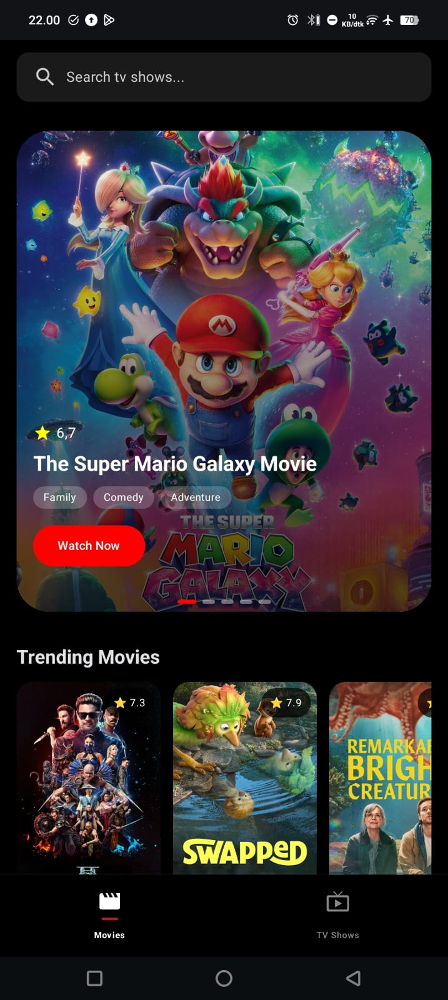
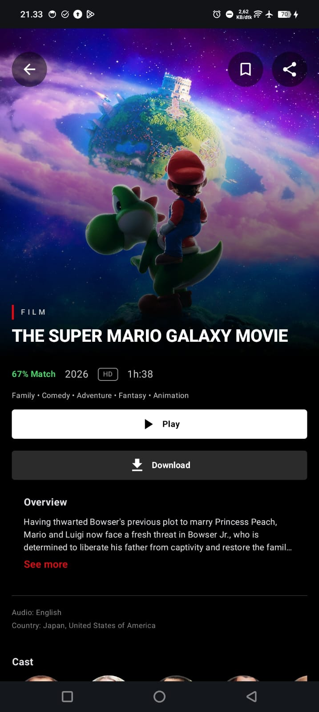
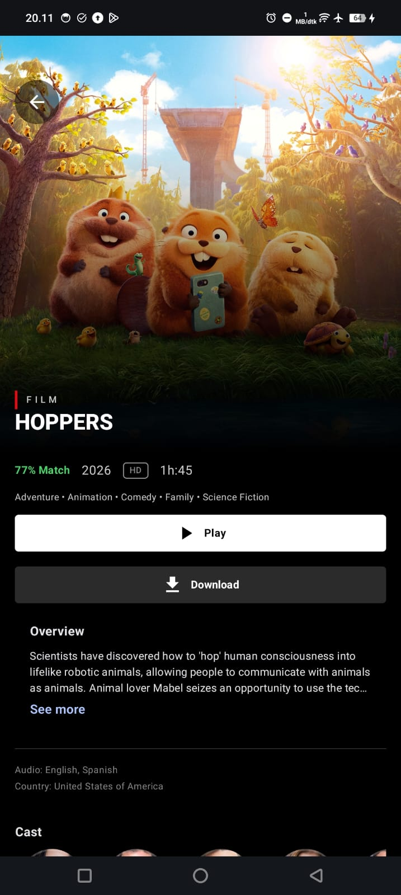
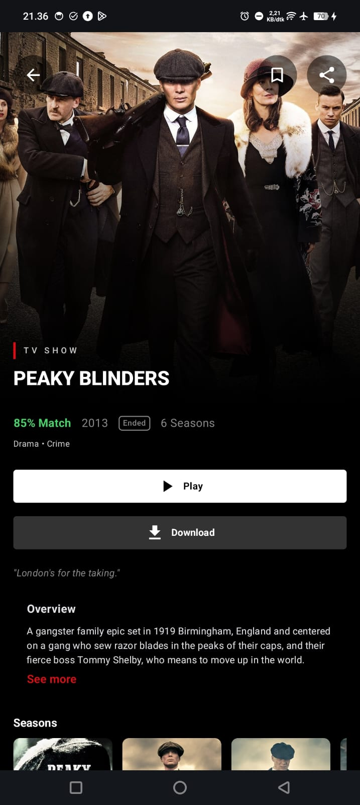

# 🎬 TMDB Movie App

A modern Android Movie & TV Series application built with **Jetpack Compose**, **Clean Architecture**, **MVVM**, and **Dependency Injection** using **Dagger Hilt**.

TMDB Movie App  allows users to discover trending movies, top-rated content, upcoming releases, search for titles, view detailed information, and save favorites locally for offline access.

---

# 🎬 TMDB Movie App

## 📱 Application Preview

<p align="center">
  
  
  
  
</p>

---

## 🎥 Demo Video

👉 https://youtu.be/UCgg1-KX2_c?si=6uIlEKwrsjWqV-yg

---

## 🎬 GIF Preview

<p align="center">
  
</p>

# ✨ Features

### 🎥 Movies

* Discover Movies
* Trending Movies
* Top Rated Movies
* Upcoming Movies
* Movie Detail Information
* Movie Recommendations
* Search Movies
* Add / Remove Favorite Movies

### 📺 TV Shows

* Airing Today TV Shows
* Popular TV Shows
* Top Rated TV Shows
* TV Show Detail Information
* TV Show Recommendations
* Search TV Shows
* Add / Remove Favorite TV Shows

### ⭐ Favorites

* Store favorite movies locally
* Store favorite TV shows locally
* Persistent favorite state
* Offline access using Room Database


### 🔍 Search

* Real-time movie search
* Real-time TV show search
* Empty state handling
* Search loading state

---

# 🏗 Architecture

This project follows **Clean Architecture** principles to ensure maintainability, scalability, and testability.

```text
Presentation
│
├── UI (Jetpack Compose)
├── ViewModel
└── State Management

Domain
│
├── Use Cases
├── Repository Contracts
└── Domain Models

Data
│
├── Repository Implementation
├── Remote Data Source
├── Local Data Source
├── DTO Mapper
└── Room Database
```

### Architecture Pattern

* MVVM (Model View ViewModel)
* Clean Architecture
* Repository Pattern
* Single Source of Truth
* Reactive Programming with Kotlin Flow

---

# 🎯 SOLID Principles

The project was designed with SOLID principles in mind:

### S — Single Responsibility Principle

Each class has a single responsibility.

Examples:

* ViewModel manages UI state
* Repository manages data sources
* Mapper converts DTO ↔ Domain ↔ Entity

### O — Open/Closed Principle

Repositories and Use Cases can be extended without modifying existing code.

### L — Liskov Substitution Principle

Repository implementations can replace repository contracts without affecting consumers.

### I — Interface Segregation Principle

Repositories expose only necessary operations.

### D — Dependency Inversion Principle

Higher-level modules depend on abstractions rather than concrete implementations.

---

# 🧩 Tech Stack

### UI

* Jetpack Compose
* Material 3
* Navigation Compose
* Coil

### Architecture

* Clean Architecture
* MVVM
* Repository Pattern

### Dependency Injection

* Dagger Hilt

### Asynchronous

* Kotlin Coroutines
* Kotlin Flow

### Local Storage

* Room Database

### Networking

* Retrofit
* OkHttp

### Serialization

* Gson Converter

### State Management

* StateFlow
* MutableStateFlow

### Other

* Parcelable
* SavedStateHandle
* Network Bound Resource Pattern

---

# 💾 Offline First Favorite System

Favorites are stored locally using Room Database.

Benefits:

* Fast access
* Offline support
* Persistent state
* Synchronization between screens

Favorite state remains consistent across:

* Home Screen
* Detail Screen
* Search Screen
* Favorite Screen

---


---

# 🚀 Getting Started

```properties
TMDB_API_KEY=YOUR_API_KEY
```

### Run

```bash
Run app on emulator or physical device
```

---

# 📊 Main Concepts Implemented

* Clean Architecture
* MVVM
* Dependency Injection
* StateFlow
* Kotlin Flow
* Room Database
* Repository Pattern
* Network Bound Resource
* Offline Favorite Feature
* Navigation Compose
* Modern Android Development

---

# 🙏 Acknowledgements

Data provided by:

* The Movie Database (TMDB)

This product uses the TMDB API but is not endorsed or certified by TMDB.

---

# 👨‍💻 Author
- Dzikry Habibie
- LinkedIn : https://www.linkedin.com/in/dzikryhabibie/
- Developed with Kotlin and Jetpack Compose as a modern Android learning project focusing on scalable architecture, clean code practices, and maintainable software design.
